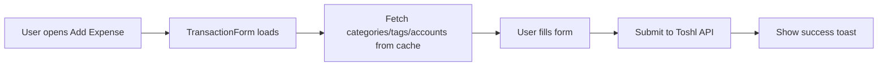
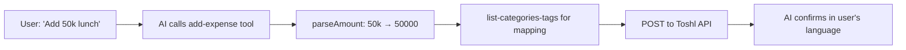
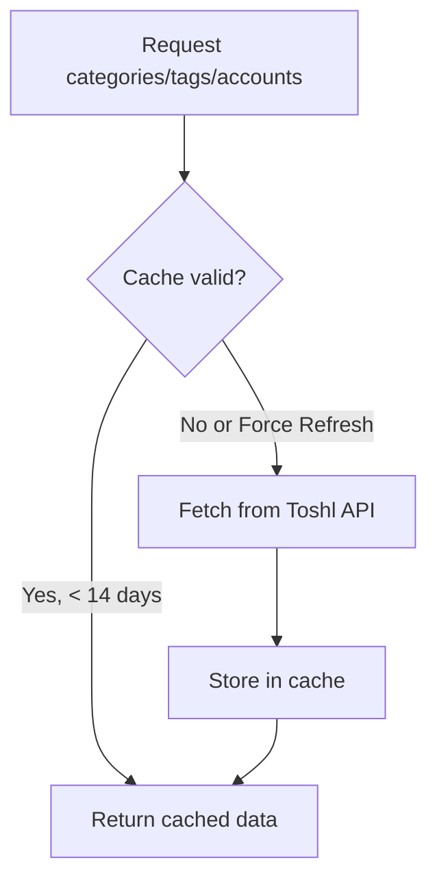

# Quick Toshl

A powerful Raycast extension for managing your [Toshl Finance](https://toshl.com) expenses, income, and budgets with both manual commands and AI-powered natural language interactions.


## ✨ Features

### Manual Commands

| Command | Description |
|---------|-------------|
| **Add Expense** | Quick form to add expenses with category, tags, account, and recurring options |
| **Add Income** | Quick form to add income entries |
| **Add Transfer** | Transfer money between accounts |
| **Recent Transactions** | View, edit, and delete recent transactions (30 days) |
| **Search Entries** | Advanced filtering by date range, type, category, tags, account, and description |
| **Budgets** | View your budget progress and spending limits |

### AI Tools (Raycast AI Chat)

Chat naturally with Raycast AI to manage your finances:

```
"Add 50k for lunch today"
"Show my expenses this month"  
"What's my food budget?"
"List my categories"
```

| AI Tool | Description |
|---------|-------------|
| `add-expense` | Add expenses with Vietnamese shortcuts (50k, 3 triệu) |
| `add-income` | Add income entries |
| `search-entries` | Search and filter transactions |
| `get-budgets` | Check budget status |
| `list-categories-tags` | List categories, tags, and accounts |

### Special Features

- 🇻🇳 **Vietnamese Support**: Amount shortcuts (50k, 3tr, 5 triệu) and bilingual responses
- 📅 **Flexible Dates**: today, yesterday, DD/MM, DD/MM/YYYY
- 🔄 **Recurring Entries**: Daily, weekly, monthly, yearly repeats
- 💱 **Multi-Currency**: Supports all Toshl currencies
- 🔵 **Transfer Detection**: Blue icons for account-to-account transfers
- ⚡ **14-Day Cache**: Fast performance with manual refresh option

---

## 🏗️ Codebase Structure

```
src/
├── components/
│   ├── TransactionForm.tsx   # Shared form for expense/income (create & edit)
│   └── TransferForm.tsx      # Transfer between accounts form
├── tools/                    # AI Chat tools
│   ├── add-expense.ts        # AI: Add expense
│   ├── add-income.ts         # AI: Add income  
│   ├── get-budgets.ts        # AI: Get budget status
│   ├── list-categories-tags.ts # AI: List categories/tags/accounts
│   └── search-entries.ts     # AI: Search & filter entries
├── utils/
│   ├── toshl.ts              # ToshlClient API wrapper with caching
│   ├── types.ts              # TypeScript interfaces
│   └── helpers.ts            # Shared utilities (parseAmount, parseDate)
├── expense.tsx               # Add Expense command
├── income.tsx                # Add Income command
├── transfer.tsx              # Add Transfer command
├── recent-transactions.tsx   # Recent Transactions list
├── search-entries.tsx        # Advanced Search UI
└── budgets.tsx               # Budgets view
```

---

## 🔄 Application Flow

### Adding an Expense (Manual)



### Adding via AI Chat



### Caching Flow



---

## 🛠️ Tech Stack

| Technology | Purpose |
|------------|---------|
| **TypeScript** | Type-safe development |
| **React** | Raycast UI components |
| **@raycast/api** | Raycast extension framework |
| **@raycast/utils** | useCachedPromise, usePromise hooks |
| **Axios** | HTTP client for Toshl API |
| **date-fns** | Date manipulation and formatting |

---

## ⚙️ Configuration

### Required

- **Toshl API Key**: Get from [Toshl Developer Settings](https://developer.toshl.com/)

### Optional

- **Default Currency**: Default currency code (e.g., VND, USD)
- **Force Refresh Cache**: Clear 14-day cache manually

---

## 🚀 Development

```bash
# Install dependencies
npm install

# Development mode
npm run dev

# Build
npm run build

# Lint
npm run lint
```

---

## 📝 API Reference

This extension uses the [Toshl API v2](https://developer.toshl.com/docs/):

- `GET /entries` - List transactions
- `POST /entries` - Create transaction/transfer
- `PUT /entries/:id` - Update transaction
- `DELETE /entries/:id` - Delete transaction
- `GET /categories` - List categories
- `GET /tags` - List tags
- `GET /accounts` - List accounts
- `GET /budgets` - List budgets
- `GET /currencies` - List supported currencies

---

## 📄 License

MIT License - see [LICENSE](LICENSE) for details.
